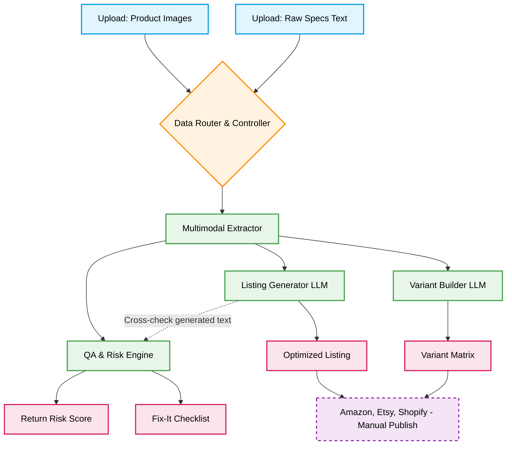

# listmate
ListMate is a listing creation + QA layer for ecommerce sellers. It generates marketplace-specific content and attributes from images/specs, builds variant matrices, and flags return-driving issues (missing specs, ambiguity, mismatches) with a Return Risk Score + checklist.

